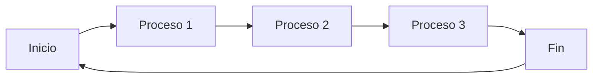
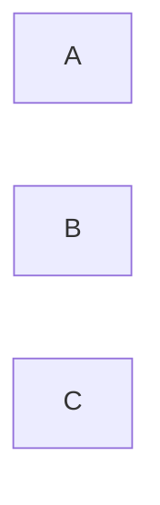
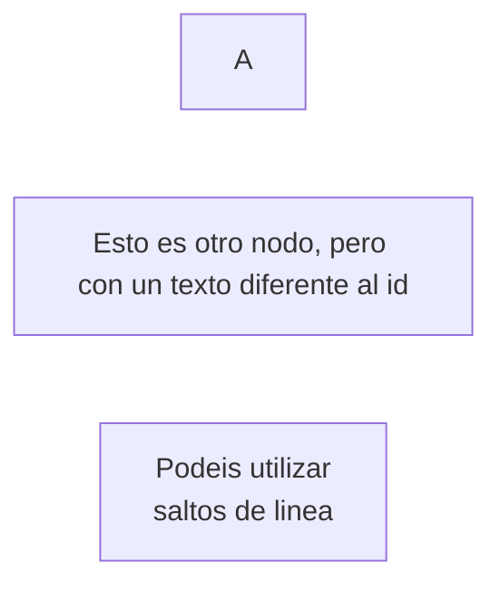
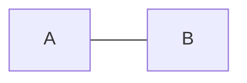
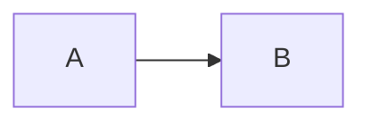
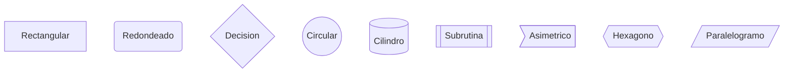

# Mermaid
Mermaid es una herramienta para crear diagramas de flujo utilizando un lenguaje de marcado de texto.
Nos puede ayudar durante el desarrollo de software para documentar procesos, pero también para cualquier otro tipo de estructura que queramos representar.

# Sintaxis
La sintaxis de Mermaid es muy sencilla, se basa en el uso de palabras clave para definir los elementos del diagrama y los conectores entre ellos.

Podemos utilizar mermaid en cualquier archivo con extension .md, .markdown o .mdown.

La cabecera de cualquier diagrama comienza con la palabra clave `flowchart`, a continuación podemos definir la dirección del diagrama, `LR` (left to right), `RL` (right to left), `TB` (top to bottom) o `BT` (bottom to top).

**RECUERDA** que markdown no puede interpretar el código de mermaid por si mismo, sin embargo, dependiendo de nuestro editor, podemos encontrar plugins que nos permitan renderizar el diagrama en tiempo real.

---
# Crear nodos
Para crear un nodo nos basta con escribirlo, a ese elemento se le conoce como id.
    

Por defecto, mermaid utiliza el texto del id para renderizar el nodo, pero podemos cambiarlo utilizando la siguiente sintaxis:

---
# Conectar elementos
## Conexion abierta

Utilizamos `---` para conectar dos elementos:
    

## Conexion cerrada

Utilizamos `-->` para conectar dos elementos:
    

---
# Forma de los nodos
Mermaid dispone de varios tipos de nodos, podemos utilizarlos para diferenciar entre acciones, decisiones, etc.
Para usarlos, debemos envolver nuestro texto entre diferentes caracteres o combinacion de estos, siendo "[]", "()" y "{}" los más utilizados.

---

