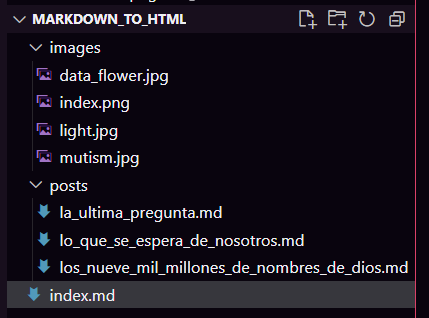

# Práctica 1

En esta práctica vamos a crear nuestra primera página web utilizando markdown.

Cuando acabes la práctica, deberías tener una página web similar a esta: https://puredata.neocities.org/ con al menos 3 posts diferentes, y un repositorio en GitHub con los archivos markdown e imagenes de tu web.

> **Recuerda**, deberías ir haciendo commits en puntos importantes del desarrollo de la práctica, incluso si eres capaz de resolverlo todo de una vez, haz commits cada vez que completes un paso que consideres importante.
>
> El repositorio de GitHub es donde debes guardar tu código fuente, es decir, todos los archivos necesarios para construir tu web, **no subas los archivos html a Github**, solo tus archivos markdown y las imágenes que uses, en sus respectivos directorios.
>
> Neocities es donde debes subir los archivos html y las imágenes de tu página web, **no subas los archivos markdown a Neocities**.

1. Crea un repositorio llamado `markdown_to_html` en tu cuenta de GitHub, clona el repositorio en tu ordenador y abre el proyecto con Visual Studio Code. 
2. Crea un **fichero** llamado `index.md` en la raíz del proyecto, este fichero será el índice de nuestra página web, pero primero necesitamos algo contenido para añadirlo aqui!
3. Crea una **carpeta** llamada `images` en la raiz del proyecto, dentro de esta carpeta es donde añadiremos las imágenes que utilizaremos en nuestra web.
4. Crea una **carpeta** llamada `posts` en la raíz del proyecto, dentro de esta carpeta es donde crearemos el contenido de nuestra web.
5. Nuestra estructura de proyecto quedará así una vez hayamos creado posts y subido imagenes:

6. Crea contenido para tu web en la carpeta `posts`:
   - Debes crear, al menos, 3 ficheros markdown dentro de esta carpeta.
   - Rellénalo de contenido, los posts pueden ser cada uno totalmente diferentes en temática y estructura, pero deben tener una estructura con sentido.
   - Cada post, debe tener, al menos:
     - Una cabecera de nivel 1 con el título del post.
     - Una cabecera de nivel 2, con la fecha de publicación del post y el autor.
     - Un párrafo de texto.
     - Una imagen.
     - Al final del post, pon un enlace a tu archivo `index.md` para que podamos volver a la página principal.
    - Sientete libre de usar otros elementos, la temática es libre, y no hay límite de tamaño para los posts.
    - Copiar y pegar contenido de internet es válido! Mejoralo de alguna forma, añade mas información, cambia su formato y estructura, etc.
    - Si no se te ocurre nada, intenta hacer una pequeña guia o tutorial de algo que conozcas, una receta, o un análisis de una película, serie, libro, etc.
7. Vamos a editar el archivo `index.md` para añadir enlaces a los diferentes posts de nuestra página web.
   - Añade una cabecera de nivel 1 con el título de tu página web.
   - Añade una cabecera de nivel 2 con una pequeña descripción de tu página web.
   - Añade una cabecera de nivel 3 con el título "Posts".
   - Crea una lista que contenga un enlace a cada uno de los posts que has creado, asegúrate de usar como texto del enlace el título del post.
8. Convierte tus archivos markdown a html, para ello podeis usar multitud de herramientas como [Stackedit](https://stackedit.io/) o algunas extensiones de Visual Studio Code como [Markdown All in One](https://marketplace.visualstudio.com/items?itemName=yzhang.markdown-all-in-one).
9. Vamos a realizar un `deploy` de nuestros archivos en [neocities](https://neocities.org/).
    - Crea una cuenta en neocities (si aun no la tienes).
    - Crea un nuevo sitio web.
    - Sube los archivos html y las imágenes a tu sitio web.
    - Comprueba que tu página web funciona correctamente.
>Asegurate de arreglar los enlaces para que apunten a los archivos html en lugar de a los archivos markdown en tu html.

