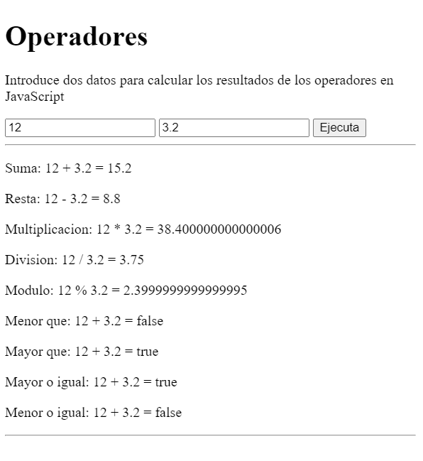

# Práctica 3

Crea una aplicación, utilizando HTML y JS con las siguientes características:

- Un h1 con el texto "Operadores"
- Un parrafo con las instrucciones
- Dos inputs de tipo numérico
- Un botón con el texto "Calcular"
- Una serie de párrafos donde se muestren los resultados de las operaciones como en la imágen:

>**RECUERDA**
>
> Las operaciones deben mostrarse en una misma línea
> 
> Asegurate de que muestras todos los operadores de js.
>
> Debes permitir resultados decimales
>
> Debes permitir números negativos
>
> No debes poder introducir letras en los inputs

>**BONUS**:
> Experimenta con el estilo visual de la aplicación, intenta aplicar algun estilo con los apuntes de clase **una vez hayas terminado la funcionalidad**.

